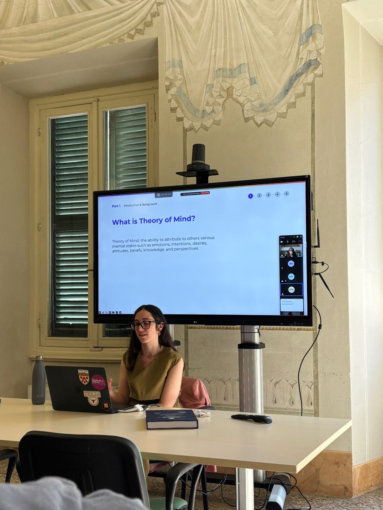

My thesis, titled "Do Machines Have a (Theory of) Mind? An Investigation across Large Language Models and Humans", explores the extent to which large language models exhibit behaviours analogous to human social cognition, with a particular focus on Theory of Mind. The defence was a rich and stimulating discussion, and I am deeply grateful to my committee: Valentina Bambini, Kyle Mahowald, and Gianluca Lebani, for their thoughtful engagement and challenging questions.

I still can't quite believe it, but I am officially a Doctor now.